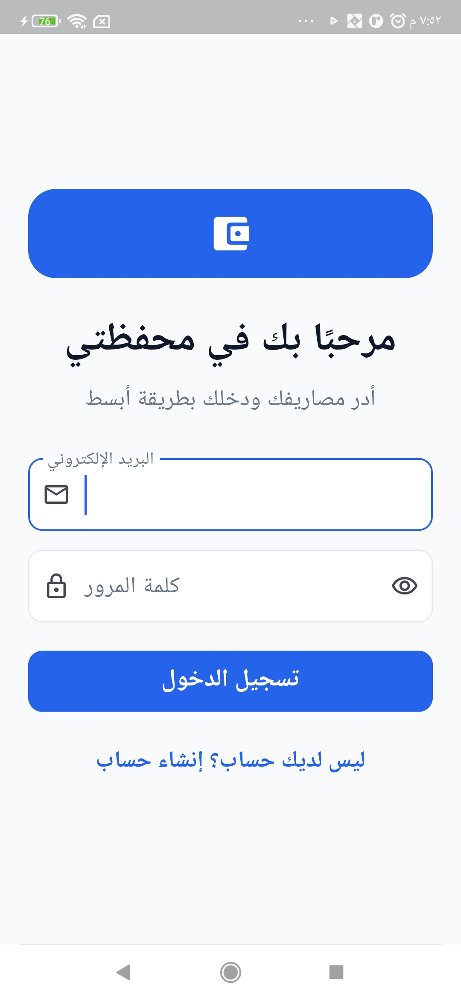
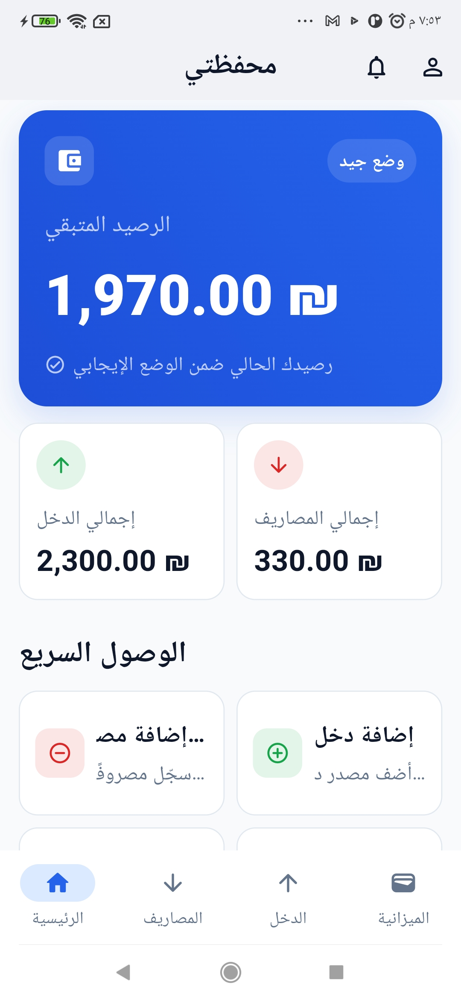
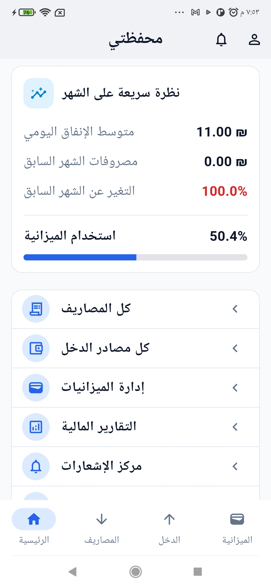
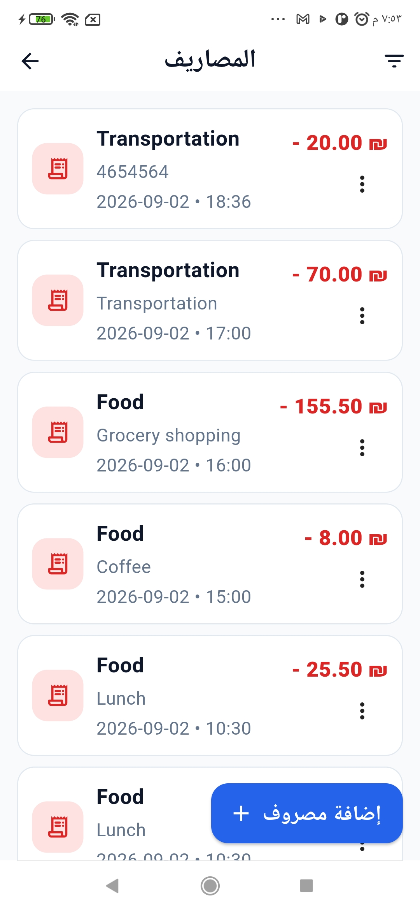
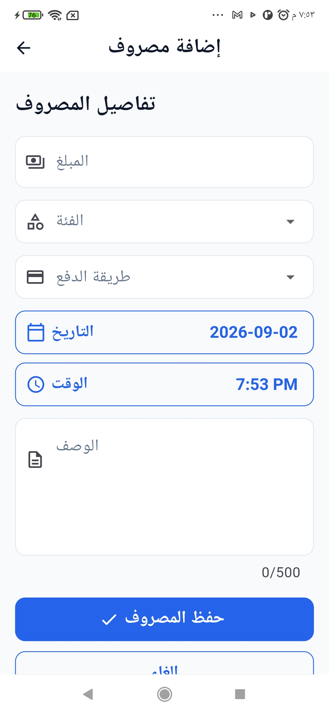
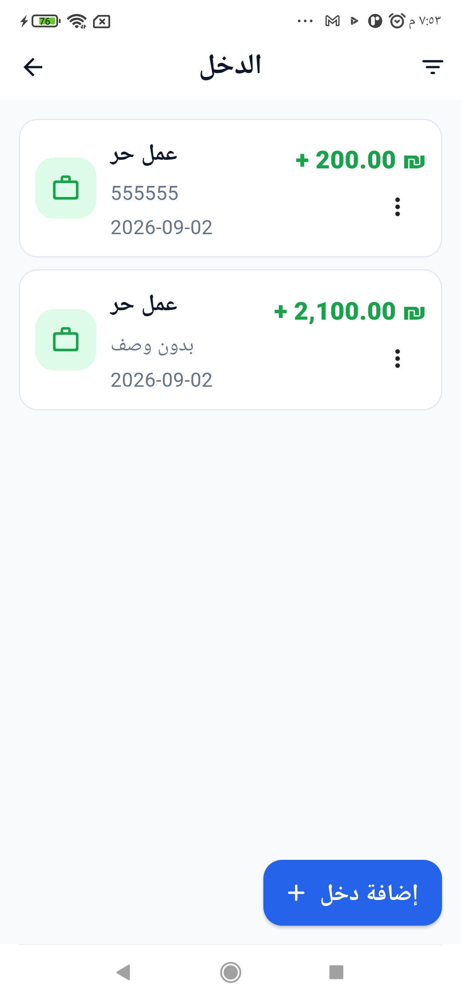
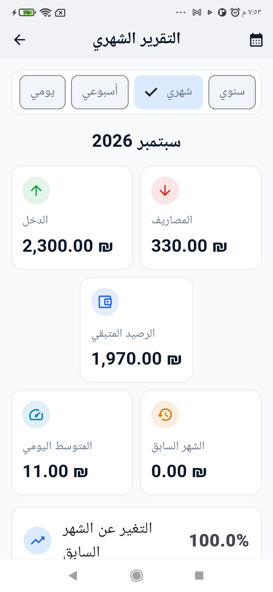
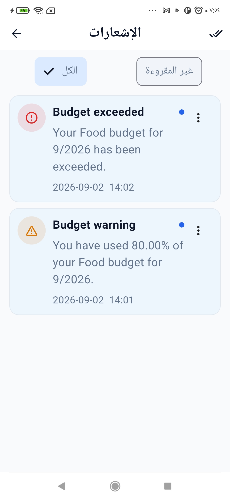
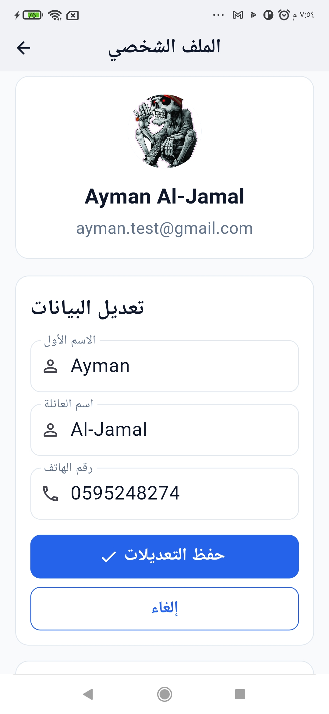

# 💰 Mahfazti — محفظتي

**Mahfazti (محفظتي)** is a full-stack personal finance management system designed to help users manage their income, expenses, budgets, categories, notifications, and financial reports through a modern mobile application connected to a secure REST API backend.

The project consists of two main applications:

```text
Mahfazti
├── Backend      → Java + Spring Boot
└── Mobile App   → Flutter + Dart
````

---

## 📌 Project Overview

Mahfazti is a personal finance management solution that combines a Java Spring Boot backend with a Flutter mobile application.

The system allows users to:

* Create an account and log in securely
* Manage personal information
* Record income
* Record and manage expenses
* Organize expenses using categories
* Create monthly budgets
* Track financial activity
* View daily, weekly, monthly, and yearly reports
* Receive financial notifications
* Monitor remaining balance
* Analyze spending behavior

The mobile application communicates with the backend through RESTful APIs secured using JWT authentication.

---

# 🏗️ Project Structure

```text
mahfazti/
│
├── .github/
│
├── image/
│   ├── 01_login.jpg
│   ├── 03_dashboard.jpg
│   ├── 04_dashboard.jpg
│   ├── 06_expenses.jpg
│   ├── 07_add_expense.jpg
│   ├── 08_budgets.jpg
│   ├── 10_reports.jpg
│   ├── 12_profile.jpg
│   └── 1_notifications.jpg
│
├── mahfazti/
│   └── Backend
│
├── mahfazti_mobile/
│   └── Flutter Mobile Application
│
├── README.md
├── CHANGELOG.md
├── CONTRIBUTING.md
└── LICENSE
```

---

# 🔵 1. Mahfazti Backend

The backend is responsible for:

* Business logic
* Authentication
* Authorization
* User management
* Database operations
* Financial calculations
* Budget management
* Notifications
* Financial reports
* REST API services

## 🛠️ Technologies

* Java
* Spring Boot
* Spring Security
* JWT
* Spring Data JPA
* Hibernate
* MySQL
* MapStruct
* Springdoc OpenAPI
* Swagger

---

# 🔐 Backend API

## Authentication

```text
POST /api/auth/login
POST /api/auth/register
```

## User

```text
GET /api/users/me
PUT /api/users/me
```

## Categories

```text
GET /api/categories
```

## Expenses

```text
GET    /api/expenses
GET    /api/expenses/{id}
POST   /api/expenses
PUT    /api/expenses/{id}
DELETE /api/expenses/{id}

GET    /api/expenses/summary
```

## Income

```text
GET    /api/incomes
GET    /api/incomes/{id}
POST   /api/incomes
PUT    /api/incomes/{id}
DELETE /api/incomes/{id}
```

## Budgets

```text
GET    /api/budgets
GET    /api/budgets/{id}
POST   /api/budgets
PUT    /api/budgets/{id}
DELETE /api/budgets/{id}
```

## Notifications

```text
GET    /api/notifications
GET    /api/notifications/unread
GET    /api/notifications/unread-count
PUT    /api/notifications/{id}/read
PUT    /api/notifications/read-all
DELETE /api/notifications/{id}
```

## Reports

```text
GET /api/reports/daily
GET /api/reports/weekly
GET /api/reports/monthly
GET /api/reports/yearly
```

---

# 🟢 2. Mahfazti Mobile

The mobile application is built using Flutter and provides the main user interface for interacting with the Mahfazti backend.

## 📱 Technologies

* Flutter
* Dart
* Riverpod
* Dio
* GoRouter
* Flutter Secure Storage
* Intl
* FL Chart
* Lucide Icons

---

# 🏗️ Mobile Architecture

The mobile application follows a layered **Clean Architecture-inspired approach**.

```text
lib/
├── app/
│   ├── app.dart
│   └── router.dart
│
├── core/
│   ├── constants/
│   │   └── api_constants.dart
│   ├── network/
│   │   └── api_client.dart
│   ├── storage/
│   │   └── secure_storage.dart
│   ├── errors/
│   │   ├── app_exception.dart
│   │   └── error_handler.dart
│   └── utils/
│       └── validators.dart
│
├── data/
│   ├── datasources/
│   │   └── remote/
│   ├── models/
│   └── repositories/
│
├── domain/
│   ├── entities/
│   ├── enums/
│   ├── repositories/
│   └── usecases/
│
├── presentation/
│   ├── providers/
│   ├── screens/
│   ├── theme/
│   └── widgets/
│
└── main.dart
```

---

# 🧩 Architecture Layers

## Presentation

Responsible for:

* Screens
* Riverpod providers
* Shared widgets
* UI state
* Navigation
* Theme

## Domain

Contains:

* Entities
* Enums
* Repository contracts
* Business abstractions
* Use case foundation

## Data

Responsible for:

* API models
* Request models
* Remote data sources
* Repository implementations
* Backend communication

## Core

Contains:

* API configuration
* Dio networking
* Secure storage
* Error handling
* Validation utilities

---

# 🔐 Authentication Flow

Mahfazti uses JWT-based authentication.

```text
┌──────────────────────────┐
│      Flutter Mobile      │
└────────────┬─────────────┘
             │
             │ Login / Register
             ▼
┌──────────────────────────┐
│   Spring Boot Backend    │
└────────────┬─────────────┘
             │
             │ Access Token
             ▼
┌──────────────────────────┐
│   Flutter Secure Storage │
└────────────┬─────────────┘
             │
             │ Bearer Token
             ▼
┌──────────────────────────┐
│  Authenticated Requests  │
└──────────────────────────┘
```

After successful authentication:

1. The backend returns an access token.
2. Flutter stores the token securely.
3. The API client automatically attaches the token.
4. Logout removes the stored token locally.

The backend does not expose a dedicated logout endpoint, so logout is handled locally by deleting the stored access token.

---

# 🔄 Application Communication

```text
┌────────────────────────────┐
│      Mahfazti Mobile       │
│       Flutter / Dart       │
└──────────────┬─────────────┘
               │
               │ HTTP / JSON
               │ JWT
               ▼
┌────────────────────────────┐
│      Mahfazti Backend      │
│     Spring Boot / Java     │
└──────────────┬─────────────┘
               │
               │ JPA / Hibernate
               ▼
┌────────────────────────────┐
│            MySQL           │
└────────────────────────────┘
```

---

# 📱 Mobile Screens

The current application includes:

```text
/login
/register
/

/expenses
/expenses/add
/expenses/edit/:id

/income
/income/add
/income/edit/:id

/budgets
/budgets/add
/budgets/edit/:id

/reports
/notifications
/profile
```

---

# 📸 Application Screenshots

The following screenshots were captured from the Mahfazti mobile application running on an **Android Redmi Note 8**.

All screenshots are stored in:

```text
image/
```

---

## 🔐 Authentication

<p align="center">
  
</p>

<p align="center">
  <b>Login Screen</b>
</p>

---

## 🏠 Dashboard

<p align="center">
  
  
</p>

<p align="center">
  <b>Dashboard & Financial Overview</b>
</p>

---

## 💸 Expenses

<p align="center">
  
  
</p>

<p align="center">
  <b>Expenses & Add Expense</b>
</p>

---

## 📊 Budgets

<p align="center">
  
</p>

<p align="center">
  <b>Budget Management</b>
</p>

---

## 📈 Reports

<p align="center">
  
</p>

<p align="center">
  <b>Financial Reports</b>
</p>

---

## 🔔 Notifications

<p align="center">
  
</p>

<p align="center">
  <b>Notifications</b>
</p>

---

## 👤 Profile

<p align="center">
  
</p>

<p align="center">
  <b>User Profile</b>
</p>

---

# 💸 Financial Management

## Expenses

Users can:

* Add expenses
* Edit expenses
* Delete expenses
* Filter expenses by date
* Filter expenses by category
* Select payment methods
* View expense summaries

### Payment Methods

```text
CASH
CREDIT_CARD
DEBIT_CARD
BANK_TRANSFER
DIGITAL_WALLET
OTHER
```

---

## 💰 Income

Users can:

* Add income
* Edit income
* Delete income
* Filter income by date

### Income Sources

```text
SALARY
FREELANCE
ALLOWANCE
GIFT
OTHER
```

---

## 📊 Budgets

Users can:

* Create budgets
* Update budgets
* Delete budgets
* Filter budgets by year and month
* Track budget usage by category

---

# 📈 Financial Reports

Mahfazti provides four report types.

## Daily Report

Includes:

* Total income
* Total expenses
* Transaction count
* Highest expense
* Category breakdown

## Weekly Report

Includes:

* Weekly expenses
* Average daily spending
* Highest spending day
* Most expensive category
* Previous week comparison
* Percentage change

## Monthly Report

Includes:

* Total income
* Total expenses
* Remaining balance
* Average daily spending
* Category breakdown
* Previous month comparison
* Budget usage percentage

## Yearly Report

Includes:

* Total annual income
* Total annual expenses
* Monthly income breakdown
* Monthly expense breakdown

---

# 🔔 Notifications

The backend supports financial notifications such as:

```text
BUDGET_WARNING
BUDGET_EXCEEDED
GOAL_PROGRESS
REMINDER
MONTHLY_REPORT
UNUSUAL_SPENDING
```

Users can:

* View all notifications
* View unread notifications
* View unread count
* Mark one notification as read
* Mark all notifications as read
* Delete notifications

---

# 🗂️ Categories

Categories organize financial activity and are used by:

* Expenses
* Budgets
* Reports
* Spending summaries

The mobile application retrieves available categories through:

```text
GET /api/categories
```

---

# 👤 User Profile

The profile section allows users to:

* View personal information
* Update first name
* Update last name
* Update phone number
* Update profile image URL
* View email
* View account role
* Logout

---

# 🎨 User Interface

The application is designed primarily for Arabic-speaking users.

The UI follows:

* Arabic interface
* RTL-friendly layout
* Material 3 design
* Centralized theme
* Centralized colors
* Centralized typography
* Responsive layouts
* Shared loading states
* Shared error states
* Shared empty states
* Consistent buttons
* Consistent form fields
* Consistent cards
* Reusable components

---

# 🌐 Development Environment

## Backend

Default backend address:

```text
http://localhost:8080
```

## Android Emulator

For Android Emulator:

```text
http://10.0.2.2:8080
```

## Flutter Web

For Flutter Web:

```text
http://localhost:8080
```

The API base URL is configured in:

```text
mahfazti_mobile/lib/core/constants/api_constants.dart
```

---

# 🚀 Running the Backend

Navigate to the backend project:

```powershell
cd mahfazti
```

Start the Spring Boot application according to its Maven configuration.

The API should be available at:

```text
http://localhost:8080
```

Swagger documentation is available when the backend is running.

---

# 🚀 Running the Mobile Application

Navigate to:

```powershell
cd mahfazti_mobile
```

Install dependencies:

```powershell
flutter pub get
```

Run on Android:

```powershell
flutter run
```

Run on a specific Android device:

```powershell
flutter run -d "Redmi Note 8"
```

Run on Chrome:

```powershell
flutter run -d chrome
```

---

# 🧪 Code Quality

Before committing changes:

```powershell
flutter analyze
```

Format the project:

```powershell
dart format lib
```

Check dependency updates:

```powershell
flutter pub outdated
```

---

# 🌿 Git Workflow

Recommended branches:

```text
main
develop
feature/*
fix/*
refactor/*
docs/*
```

Examples:

```text
feature/authentication
feature/expense-management
feature/income-management
feature/budget-management
feature/reports
feature/notifications
fix/api-parsing
fix/android-build
refactor/repository-layer
docs/readme
```

---

# 📂 Repository Organization

```text
mahfazti/
│
├── .github/
│
├── image/
│   ├── 01_login.jpg
│   ├── 03_dashboard.jpg
│   ├── 04_dashboard.jpg
│   ├── 06_expenses.jpg
│   ├── 07_add_expense.jpg
│   ├── 08_budgets.jpg
│   ├── 10_reports.jpg
│   ├── 12_profile.jpg
│   └── 1_notifications.jpg
│
├── mahfazti/
│   ├── src/
│   ├── pom.xml
│   └── ...
│
├── mahfazti_mobile/
│   ├── lib/
│   ├── android/
│   ├── ios/
│   ├── assets/
│   ├── pubspec.yaml
│   └── ...
│
├── README.md
├── CHANGELOG.md
├── CONTRIBUTING.md
└── LICENSE
```

---

# 🔒 Security

## Backend

The backend uses:

* Spring Security
* JWT authentication
* Secure password hashing
* Role-based authorization
* Protected REST endpoints
* User-specific data access

## Mobile

The mobile application uses:

* Secure JWT storage
* Bearer authentication
* Centralized API authentication
* Flutter Secure Storage

Sensitive credentials, secrets, and environment configuration should never be committed to Git.

---

# 🛠️ Development Features

## API Client

The Flutter application uses a centralized Dio API client for:

* GET requests
* POST requests
* PUT requests
* DELETE requests
* Authorization headers
* Request configuration
* Error handling

---

## Error Handling

The application supports centralized handling of:

```text
Network Errors
Server Errors
Unauthorized Requests
Forbidden Requests
Not Found
Validation Errors
Conflict Errors
Unknown Errors
```

---

## Validation

Reusable validators are provided for:

* Required fields
* Names
* Email addresses
* Passwords
* Password confirmation
* Phone numbers
* Amounts
* Descriptions
* Years
* Months
* Integer values

---

# 📌 Development Status

## 🔵 Backend

```text
✅ Authentication
✅ JWT Security
✅ User Management
✅ Category Management
✅ Expense Management
✅ Income Management
✅ Budget Management
✅ Notifications
✅ Daily Reports
✅ Weekly Reports
✅ Monthly Reports
✅ Yearly Reports
✅ MySQL Integration
✅ JPA / Hibernate
✅ Swagger / OpenAPI
```

## 🟢 Mobile

```text
✅ Flutter Project Foundation
✅ Layered Architecture
✅ API Client
✅ JWT Authentication
✅ Secure Token Storage
✅ Error Handling
✅ Validation
✅ Domain Entities
✅ Domain Enums
✅ Data Models
✅ Request Models
✅ Remote Data Sources
✅ Repository Contracts
✅ Repository Implementations
✅ Riverpod Providers
✅ Application Theme
✅ Routing
✅ Dashboard
✅ Expenses Screens
✅ Income Screens
✅ Budget Screens
✅ Reports Screen
✅ Notifications Screen
✅ Profile Screen
✅ Responsive UI Foundation
✅ Arabic / RTL-friendly UI
✅ Android Configuration
✅ Flutter Web Support
```

## 🔄 Current Improvements

```text
🔄 Final UI / UX refinements
🔄 Additional responsive improvements
🔄 Expanded widget testing
🔄 Integration testing
🔄 Authentication route guards
🔄 Production release configuration
🔄 Further Clean Architecture refinement
```

---

# 📦 Application Build

Build Android APK:

```powershell
flutter build apk
```

Build release APK:

```powershell
flutter build apk --release
```

Build Flutter Web:

```powershell
flutter build web
```

---

# 📱 Supported Platforms

The project currently targets:

* Android
* Web
* Windows development environment

The primary target platform is Android mobile.

---

# 👨‍💻 Developer

**Ayman Al-Jamal**

Computer Science Graduate

Backend Engineering
Java & Spring Boot
Flutter Mobile Development
REST API Development
Full-Stack Application Development

---

# 📄 License

This project is currently intended for educational and development purposes.

A formal open-source license can be added in the future.

---

# ⭐ Mahfazti

> **Manage your money. Understand your spending. Build better financial habits.**

**محفظتي — إدارة أموالك أصبحت أسهل.**

````

ولرفع هذا الـ README بعد حفظه:

```powershell
git add README.md
git commit -m "docs: update project README and screenshots"
git push origin main
````

